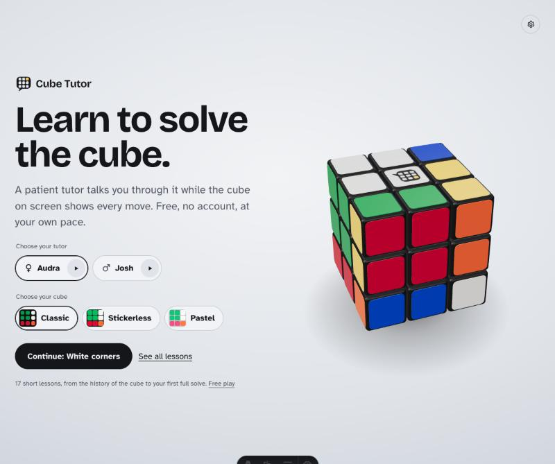
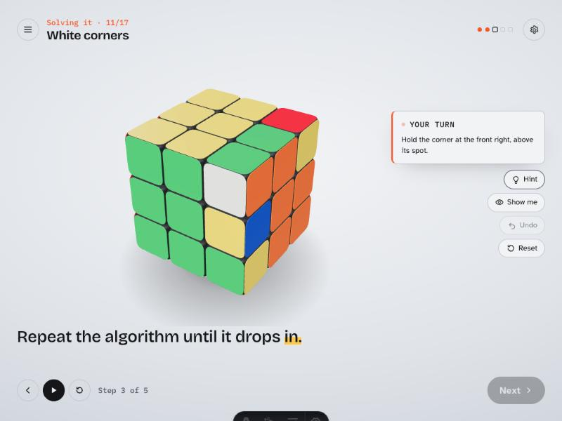
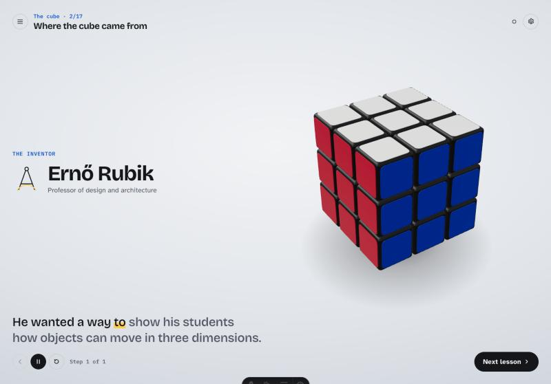

<div align="center">

<picture>
  <source media="(prefers-color-scheme: dark)" srcset="docs/images/logo-dark.svg">
  
</picture>

# Cube Tutor

**Learn to solve the 3×3 cube with a patient, narrated tutor and an interactive 3D cube.**
Free, open source, no account needed.

**[cubetutor.lauroguedes.dev](https://cubetutor.lauroguedes.dev)**

[](https://github.com/lauroguedes/cube-tutor/actions/workflows/ci.yml)
[](LICENSE)
[](https://astro.build)
[](https://vuejs.org)
[](https://threejs.org)
[](https://www.typescriptlang.org)
[](https://vitest.dev)
[](https://workers.cloudflare.com)
[](https://nodejs.org)
[](#contributing)
[](https://buymeacoffee.com/lauroguedes)



</div>

## Table of contents

- [About](#about)
- [Features](#features)
- [Screenshots](#screenshots)
- [Tech stack](#tech-stack)
- [Getting started](#getting-started)
- [Scripts](#scripts)
- [Narration (ElevenLabs)](#narration-elevenlabs)
- [Project structure](#project-structure)
- [How it works](#how-it-works)
- [Testing](#testing)
- [Adding a language](#adding-a-language)
- [Deployment](#deployment)
- [Contributing](#contributing)
- [Acknowledgements](#acknowledgements)
- [License](#license)

## About

Cube Tutor teaches complete beginners to solve the 3×3 cube. A tutor talks you through each idea while a realistic 3D cube performs every move in sync with the voice. Short tasks check that you can actually do each step before the next lesson opens.

The course has 17 lessons in four parts:

1. **The cube**: its history, told as an animated story, and how its pieces work.
2. **Moving the cube**: turning layers, notation, following a piece, your first algorithm.
3. **Solving it**: the beginner layer-by-layer method, from the daisy to the last edges.
4. **On your own**: solving a full scramble from start to finish.

Progress is saved in your browser. There are no accounts and no tracking.

## Features

- 🎙️ **Narrated tutor**: two voices per language (Audra and Josh in English, Fernanda and Cristian in Portuguese), with captions that highlight each word as it is spoken.
- 🧊 **Interactive 3D cube**: drag a face to turn it, drag around it to look from any side, or use the keyboard (`R L U D F B`, `Shift` for counter-clockwise).
- 🎬 **Moves in sync with the voice**: turns, highlights, arrows, camera moves and the exploded view happen on the exact word they belong to.
- ✅ **Tasks that check understanding**: tasks are judged by the cube's state, so any correct approach passes. Each one has hints, a *Show me* demo, undo and reset.
- 📖 **History as a story**: animated scenes (a timeline, the 43-quintillion count, a 1982 stopwatch…) play alongside the narration.
- 🔊 **Sound**: every turn makes a real cube click, and free play has calm focus music. Both can be turned off in Settings.
- 🎨 **Three cube styles**: Classic, Stickerless and Pastel.
- 🌗 **Light and dark themes**, following the system or set by hand.
- 🕹️ **Free play mode** with scramble, undo/redo, face letters and an exploded view of the mechanism.
- ♿ **Accessible**: keyboard control, visible focus, captions, screen-reader labels and reduced-motion support.
- 🌍 **English and Brazilian Portuguese**: the whole course, narration included, in both languages. Switch with the language button next to Settings; the home page opens in the visitor's language.

## Screenshots

| A task beside the cube | The history lesson as an animated story |
| :---: | :---: |
|  |  |

## Tech stack

| Area | Tools |
| --- | --- |
| Framework | [Astro 7](https://astro.build) (static output) with [Vue 3](https://vuejs.org) islands for the interactive parts |
| 3D | [Three.js](https://threejs.org): physically based materials, studio lighting, custom drag-to-turn controls |
| Language | [TypeScript](https://www.typescriptlang.org) in strict mode |
| Narration | [ElevenLabs](https://elevenlabs.io) text-to-speech (`eleven_v4`) with character timestamps, generated at build time |
| Testing | [Vitest](https://vitest.dev) |
| Hosting | [Cloudflare Workers](https://developers.cloudflare.com/workers/static-assets/) static assets, deployed by GitHub Actions |
| SEO | Open Graph / Twitter cards, schema.org data, [`@astrojs/sitemap`](https://docs.astro.build/en/guides/integrations-guide/sitemap/) |
| Fonts | [Bricolage Grotesque](https://fonts.google.com/specimen/Bricolage+Grotesque), [Atkinson Hyperlegible](https://www.brailleinstitute.org/freefont/), [IBM Plex Mono](https://www.ibm.com/plex/), self-hosted via [Fontsource](https://fontsource.org) |

## Getting started

### Prerequisites

- [Node.js](https://nodejs.org) **22.12 or newer** (even-numbered releases)
- npm (comes with Node)

### Install and run

```bash
git clone https://github.com/lauroguedes/cube-tutor.git
cd cube-tutor
npm install
npm run dev
```

Then open the URL printed in the terminal (by default <http://localhost:4321>).

The narration audio is already in the repository (`public/audio`), so the full course works without an ElevenLabs account. You only need one to change or add narration (see [Narration](#narration-elevenlabs)).

## Scripts

| Command | What it does |
| --- | --- |
| `npm run dev` | Start the development server |
| `npm run build` | Build the static site into `dist/` |
| `npm run preview` | Serve the built site locally |
| `npm run check` | Type-check the whole project (`astro check`) |
| `npm test` | Run the test suite once |
| `npm run test:watch` | Run tests in watch mode |
| `npm run narrate` | Generate narration audio for new or changed lines |
| `npm run sounds` | Generate the cube click sounds and the free play music (ElevenLabs) |
| `npm run brand` | Regenerate the logo files and favicon from `src/brand/logo.ts` |
| `npm run og` | Regenerate the social share image and PNG app icons |
| `npm run deploy` | Build and deploy to Cloudflare with Wrangler |
| `npm run preview:cf` | Build and serve the site in the local Cloudflare runtime |

## Narration (ElevenLabs)

Narration is generated ahead of time by `tools/narrate`, never in the browser, so no API key reaches visitors.

1. Copy the example environment file:

   ```bash
   cp .env.example .env
   ```

2. Fill it in:

   | Variable | Description |
   | --- | --- |
   | `ELEVENLABS_API_KEY` | API key with text-to-speech permission |
   | `ELEVENLABS_VOICE_FEMALE_ID` | Voice ID for the female English tutor (Audra) |
   | `ELEVENLABS_VOICE_MALE_ID` | Voice ID for the male English tutor (Josh) |
   | `ELEVENLABS_MODEL_ID` | Model to use. Defaults to `eleven_v4` |

3. Generate:

   ```bash
   npm run narrate -- --dry-run   # show what would be generated and how many characters
   npm run narrate                # generate missing or changed clips for both voices
   npm run narrate -- --locale pt-br  # the same for Brazilian Portuguese
   ```

Each clip is cached by its text, voice and model, so only new or edited lines use characters. Portuguese voices (Fernanda and Cristian) are set in `tools/narrate/narrate.ts`. Options: `--voice female|male`, `--only <step-id,...>`, `--locale <code>`, `--force`.

## Project structure

```text
cube-tutor/
├── .github/              # CI + Cloudflare deploy workflow, Dependabot
├── docs/                 # Development plan, fact-check sources, README images
├── public/
│   ├── audio/            # Narration per locale, cube sounds (sfx/) and focus music (music/)
│   ├── _headers          # Security and cache headers (Cloudflare)
│   └── logo.svg …        # Logo files, favicon, share image, manifest
├── src/
│   ├── audio/            # Turn click sounds (Web Audio) and the free play music player
│   ├── brand/            # Logo source and project credits
│   ├── components/       # Vue islands: lesson player, home, free play, settings…
│   ├── course/           # The 17 lessons: structure (lessons.ts) and text (text/<locale>.ts)
│   ├── engine/           # Cube logic: state, notation, goal checks (pure TypeScript)
│   ├── i18n/             # UI strings per locale
│   ├── layouts/          # Page shell
│   ├── pages/            # Routes: /, /learn, /learn/[lesson], /play, and the same under /pt-br/
│   ├── render/           # Three.js cube, materials, animation and input
│   ├── styles/           # Design tokens and shared styles
│   ├── tutor/            # Narration scripts, audio-synced player, progress, story scenes
│   └── views/            # Page bodies shared by every language's routes
└── tools/
    ├── brand/            # Logo/favicon generator
    ├── narrate/          # ElevenLabs narration generator
    ├── sounds/           # ElevenLabs sound effects and music generator
    └── og/               # Social share image and app icon generator
```

## How it works

- **The engine is the single source of truth.** `src/engine` models the cube as 26 pieces, each with a rotation, so the logic stays exact with no floating-point drift. The 3D view draws every piece straight from that state.
- **Lessons are judged by state, not by moves.** A task such as "solve the white cross" checks the cube against its center colors (`src/engine/predicates.ts`), so a learner can rotate the cube or find their own way.
- **The voice is the clock.** Narration scripts contain cue markers such as `{{move R}}` or `{{highlight piece:white,green}}`. ElevenLabs returns a timestamp for every character, so each cue fires on the word that follows it.
- **Claims are proven.** Every algorithm the tutor teaches has a test that proves it does what the narration says (`src/engine/algorithms.test.ts`). The history facts are sourced in [`docs/SOURCES.md`](docs/SOURCES.md).

## Testing

```bash
npm test         # unit tests
npm run check    # type-check
```

The suite covers the cube engine (move notation, group properties, goal checks), every beginner algorithm, narration parsing and timing, and course integrity: every step has text in every language with the same cues, every task starts unsolved, and every *Show me* solution actually completes its task.

## Adding a language

1. Add the locale to `astro.config.mjs` (`i18n` and the sitemap) and to `src/i18n/ui.ts`, including its entry in `LOCALES`. The types ensure no UI string is missing.
2. Copy `src/course/text/en.ts` to the new locale and translate it, keeping the `{{…}}` cue markers.
3. Add the routes under `src/pages/<locale>/`, mirroring `src/pages/pt-br/` (each one renders a view from `src/views/`).
4. Add the share card to `tools/og/generate.ts` and run `npm run og`.
5. Add the voice IDs to `tools/narrate/narrate.ts` and run `npm run narrate -- --locale <code>`.
6. Run `npm test`. It fails if any lesson step is missing text or its cue markers differ from English.

## Deployment

The build output is a fully static site (`dist/`), served by [Cloudflare Workers static assets](https://developers.cloudflare.com/workers/static-assets/). The configuration is in [`wrangler.jsonc`](wrangler.jsonc): the site's own 404 page, automatic trailing slashes, and the custom domain `cubetutor.lauroguedes.dev`. Response headers (security and caching) live in [`public/_headers`](public/_headers).

### Automatic (GitHub Actions)

The [CI workflow](.github/workflows/ci.yml) type-checks, tests and builds every push and pull request. Pushes to `main` are then deployed to Cloudflare once two repository secrets are set (**Settings → Secrets and variables → Actions**):

| Secret | Where to find it |
| --- | --- |
| `CLOUDFLARE_API_TOKEN` | Cloudflare dashboard → My Profile → API Tokens → *Create token* with the **Edit Cloudflare Workers** template |
| `CLOUDFLARE_ACCOUNT_ID` | Cloudflare dashboard → Workers & Pages → Account ID (right sidebar) |

Until they exist, the deploy job is skipped with a notice and CI still runs.

### Manual

```bash
npx wrangler login
npm run deploy
```

To deploy somewhere else, set `SITE_URL` at build time so canonical URLs, social cards and the sitemap point at the right address (`SITE_URL=https://example.com npm run build`), and update the custom domain in `wrangler.jsonc`.

## Contributing

Contributions are welcome: bug reports, translations, lesson improvements and code.

1. Fork the repository and create a branch: `git checkout -b my-change`.
2. Make your change. Please keep `npm test` and `npm run check` passing.
3. If you change what the tutor says about an algorithm, add or update its proof in `src/engine/algorithms.test.ts`.
4. Open a pull request describing what changed and why.

Found a problem? [Open an issue](https://github.com/lauroguedes/cube-tutor/issues).

## Acknowledgements

- Narration voices, cube sounds and focus music generated with [ElevenLabs](https://elevenlabs.io).
- History facts checked against the sources listed in [`docs/SOURCES.md`](docs/SOURCES.md).
- The beginner layer-by-layer method is a long-standing teaching approach shared by the cubing community.

*Rubik's Cube is a trademark of its respective owner. Cube Tutor is an independent, non-commercial project and is not affiliated with or endorsed by the trademark holder.*

## License

The code is released under the [MIT License](LICENSE). © 2026 [Lauro Guedes](https://lauroguedes.dev).

If Cube Tutor helped you, you can [buy me a coffee](https://buymeacoffee.com/lauroguedes) ☕

The bundled fonts are licensed under the SIL Open Font License. The audio in `public/audio` (narration, sound effects and music) was generated with ElevenLabs; reusing it is subject to [ElevenLabs' terms](https://elevenlabs.io/terms-of-use).
